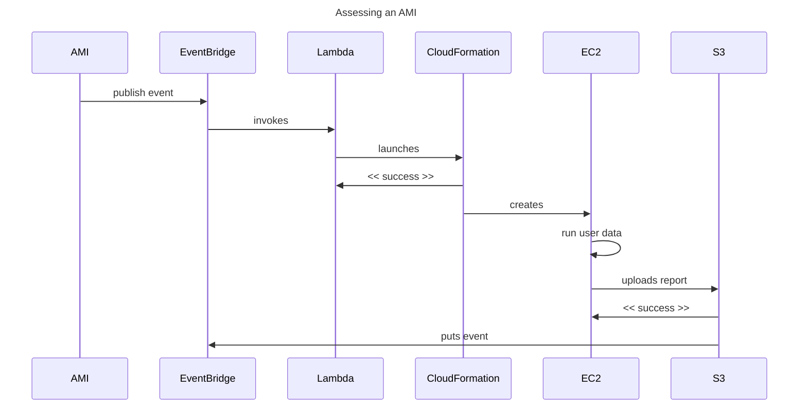
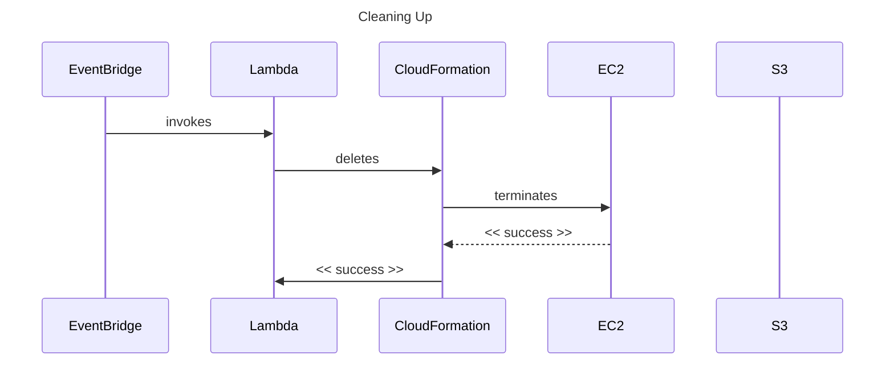
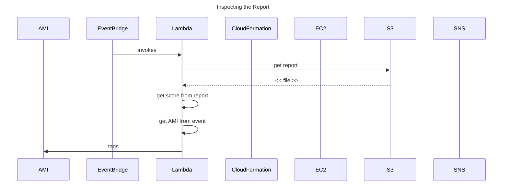
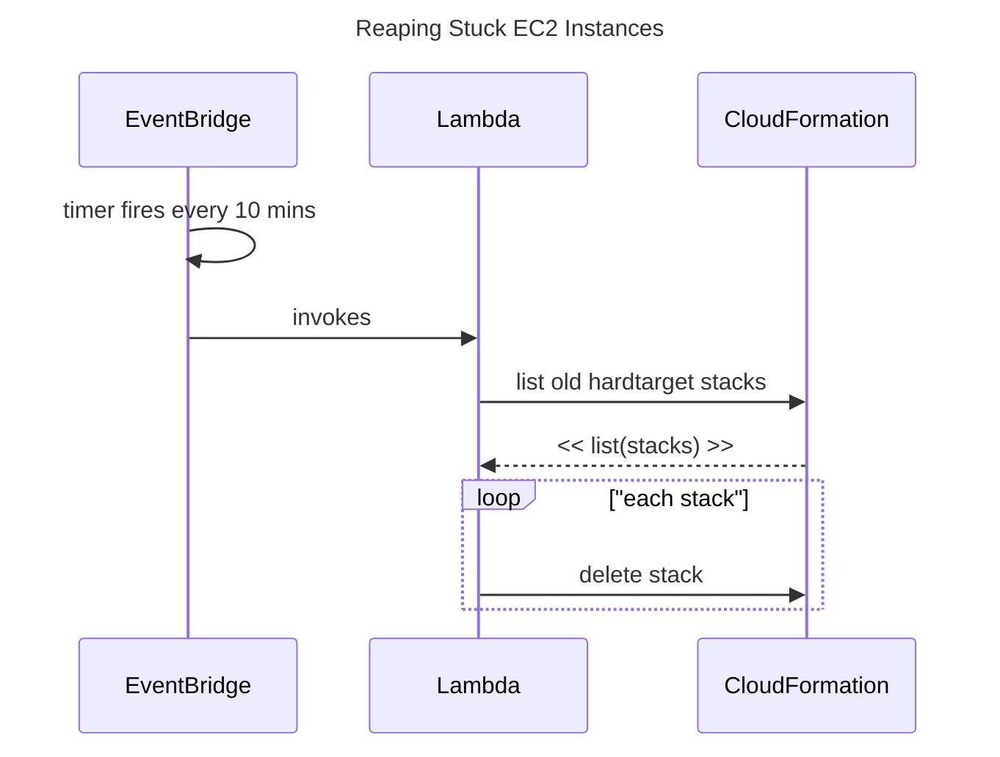

# Hard Target

A serverless solution to provide security assessments of newly built AMIs.

This project relies heavily on Amazon Web Services (AWS).

## Logic

When a new AMI is built, an event is published onto EventBridge.
This project captures that event and initiates a set of processes.
The first process is to spin up an EC2 instance using the newly built
AMI.  Once the server has started, Lynis is installed and then run so
that it generates a report.  This should take about 3 minutes.  Once the
report is ready, it is uploaded to an S3 bucket for permanent storage.
Finally, the server shuts itself down.

When the report lands in the S3 bucket, an event notification occurs
which notifies Event Bridge.  This invokes two Lambda functions.  The
first shuts down the EC2 instance.  The second inspects the report, pulls
out the score, then tags the AMI with the score.

And finally, there is a Lambda function which runs every 10 minutes to
check whether there are any old EC2 instances still sitting around doing
nothing.  Perhaps they got stuck.  It terminates them.

### Sequence Diagrams

#### Assessing an AMI

#### Cleaning Up

#### Inspecting the Report

#### Reaping Stuck EC2 Instances

## Goals

This project lives by the following goals:

1. Do not interfere with normal servers.  This would break immutable infrastructure environments.
1. Do not impact the existing infrastructure environment.  Play well with others.
1. Do not cost too much money.  Security is still seen as a cost centre.
1. Do not keep persistent servers around.
1. Gather data, do not apply policy.  AMIs are tagged with a score.  It is up to service teams to implement their own standards of what is secure.

