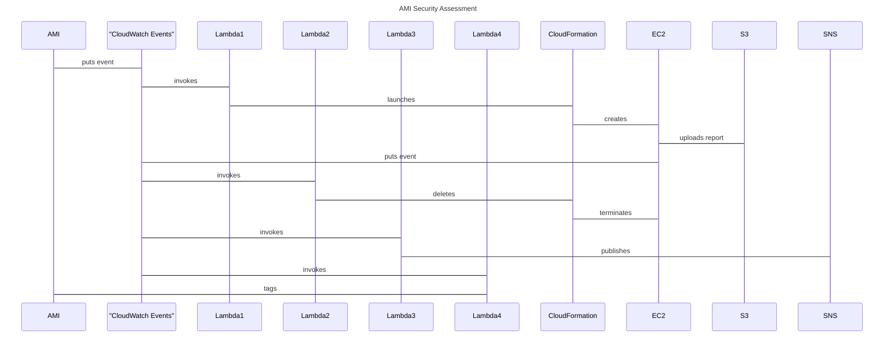

# Hard Target

A serverless solution to provide security assessments of newly built AMIs.

This project relies heavily on Amaon Web Services (AWS).

## Logic

When a new AMI is built, a CloudWatch Event is published onto the event
bus.  This project captures that event and initiates a set of processes.
The first process is to spin up an EC2 instance using the newly built
AMI.  Once the server has started, Lynis is installed and

## Goals

This project lives by the following goals:

1. Do not interfere with normal servers.  This would break immutable infrastructure environments.
1. Do not impact the existing infrastructure environment.  Play well with others.
1. Do not cost too much money.  Security is still seen as a cost centre.
1. Do not keep persistent servers around.
1. Gather data, do not apply policy.  AMIs are tagged with a score.  It is up to service teams to implement their own standards of what is secure.

